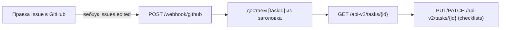
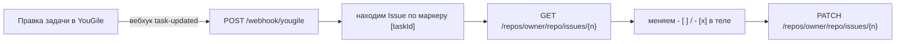
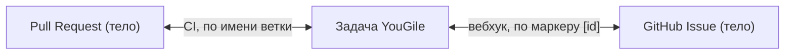

# AutoAgile — двусторонняя синхронизация YouGile ↔ GitHub

Проект автоматически связывает задачи в **YouGile** с **GitHub** и держит их синхронными:
создаёт ветки, Issues и Pull Request'ы по новым задачам и в реальном времени
синхронизирует чек-листы (галочки) между YouGile и GitHub Issues в обе стороны.

Если ты открыл этот репозиторий впервые — читай сверху вниз, здесь всё по шагам.

---

## Содержание

1. [Что это вообще делает](#что-это-вообще-делает)
2. [Из чего состоит](#из-чего-состоит)
3. [Что нужно заполнить в .env](#что-нужно-заполнить-в-env)
4. [Как запустить (по шагам)](#как-запустить-по-шагам)
5. [Настройка вебхуков](#настройка-вебхуков)
6. [Как это работает внутри](#как-это-работает-внутри)
7. [Как связаны Issue и Pull Request](#как-связаны-issue-и-pull-request)
8. [Частые проблемы](#частые-проблемы-troubleshooting)
9. [Структура репозитория](#структура-репозитория)

---

## Что это вообще делает

Одна задача в YouGile порождает в GitHub три вещи:

- **Ветку** `feature/<коротки-id>-<название>`;
- **Issue** с заголовком `[<id задачи YouGile>] Название` и чек-листом в теле;
- **Pull Request** (ветка → `dev`) с тем же чек-листом.

А дальше галочки в чек-листе синхронизируются:

- поставил галочку в **GitHub Issue** → она появится в **YouGile**;
- поставил галочку в **YouGile** → она появится в **GitHub Issue**;
- галочки в **Pull Request** тоже уезжают в YouGile (через GitHub Actions).

---

## Из чего состоит

Три части, которые работают вместе:

| Часть | Команда запуска | Что делает |
| --- | --- | --- |
| **Поллер** | `python -m app.main` | Раз в N секунд опрашивает колонку YouGile. На новую задачу создаёт ветку и GitHub Issue, прописывает связи. |
| **Вебхук-сервер** | `uvicorn app.webhook_server:app --host 0.0.0.0 --port 8000` | Принимает вебхуки от GitHub и YouGile и синхронизирует чек-листы в реальном времени. |
| **GitHub Actions** | автоматически в GitHub | При пуше в ветку `feature/**` гоняет тесты и создаёт PR с чек-листом; при изменении PR отправляет чек-лист обратно в YouGile. |

---

## Что нужно заполнить в .env

В корне проекта есть файл `.env` (шаблон — в `.env.example`). Заполни его так:

```bash
# --- YouGile ---
YOUGILE_BEARER_TOKEN=токен_из_YouGile        # Настройки → API → создать ключ
YOUGILE_PROJECT_ID=id_проекта
YOUGILE_BOARD_ID=id_доски
YOUGILE_COLUMN_ID=id_колонки                  # колонка, за которой следим и куда падают новые задачи
YOUGILE_POLL_INTERVAL=10                      # период опроса в секундах

# --- GitHub ---
GITHUB_TOKEN=ghp_личный_токен                 # Personal Access Token с правами на Issues (scope "repo")
GITHUB_REPO=owner/repo                         # например: rlxlxl/AutoAgile

# --- Секреты вебхуков ---
GITHUB_WEBHOOK_SECRET=любая_строка            # придумай сам, эту же строку вставишь в настройки вебхука GitHub
YOUGILE_WEBHOOK_SECRET=                        # ОСТАВЬ ПУСТЫМ! (см. пояснение ниже)
```

> **Важно про `YOUGILE_WEBHOOK_SECRET`:** YouGile не подписывает свои вебхуки,
> поэтому если сюда что-то вписать — сервер будет отклонять все запросы от YouGile
> с ответом `{"skipped":"invalid_signature"}`, и обратная синхронизация не заработает.
> Оставляй это поле пустым.

> **Важно:** настройки читаются **один раз при запуске**. Если поменял `.env` —
> перезапусти поллер и вебхук-сервер, иначе изменения не подхватятся.

### Где взять значения YouGile

- **Токен:** в YouGile → Настройки → раздел API.
- **project / board / column ID:** при первом запуске `python -m app.main` откроется
  интерактивное меню выбора проекта/доски/колонки, и оно само сохранит эти ID в `.env`.
  Либо через API: `GET https://ru.yougile.com/api-v2/tasks?columnId=<id>` — у объектов есть поле `id`.

---

## Как запустить (по шагам)

### 1. Установить зависимости

```bash
python3 -m venv venv
source venv/bin/activate
pip install -r requirements.txt
```

### 2. Заполнить `.env`

См. раздел выше.

### 3. Запустить вебхук-сервер (терминал №1)

```bash
source venv/bin/activate
uvicorn app.webhook_server:app --host 0.0.0.0 --port 8000
```

Проверка: открой `http://localhost:8000/health` — должно вернуться `{"status":"ok", ...}`.

### 4. Запустить поллер (терминал №2)

```bash
source venv/bin/activate
python -m app.main
```

В логах должно быть `GitHub Issues auto-creation enabled for owner/repo`. Если написано
«авто-создание Issues отключено» — значит не заданы `GITHUB_TOKEN` или `GITHUB_REPO`.

### 5. Дать серверу публичный адрес (терминал №3)

GitHub и YouGile должны «дозвониться» до твоего сервера, поэтому нужен публичный HTTPS.
Проще всего через ngrok:

```bash
ngrok http 8000
```

ngrok выдаст адрес вида `https://xxxx.ngrok-free.dev` — это твой `<host>`.

> Если перезапустишь ngrok — адрес поменяется, и его придётся заново прописать
> в вебхуках GitHub и YouGile (см. ниже).

---

## Настройка вебхуков

### GitHub

Репозиторий → **Settings → Webhooks → Add webhook**:

- **Payload URL:** `https://<host>/webhook/github` (внимание: `webhook`, БЕЗ `s` на конце!)
- **Content type:** `application/json`
- **Secret:** та же строка, что в `GITHUB_WEBHOOK_SECRET`
- **Which events:** «Let me select individual events» → отметить **Issues** и **Issue comments**
- Сохранить.

### YouGile

Подписка создаётся одной командой (подставь свой токен и `<host>`):

```bash
curl -X POST https://ru.yougile.com/api-v2/webhooks \
  -H "Authorization: Bearer ТВОЙ_YOUGILE_TOKEN" \
  -H "Content-Type: application/json" \
  -d '{"url":"https://<host>/webhook/yougile","event":"task-updated"}'
```

> Опять же: адрес `/webhook/yougile` — **без `s`**. Самая частая ошибка — написать
> `/webhooks/...`, тогда все запросы будут падать с `404`.

Посмотреть/проверить существующие подписки:

```bash
curl -s -H "Authorization: Bearer ТВОЙ_YOUGILE_TOKEN" https://ru.yougile.com/api-v2/webhooks
```

---

## Как это работает внутри

### Как связываются задача и Issue

ID задачи YouGile пишется в **заголовок GitHub Issue** в квадратных скобках:

```
[a0301b39-4d7a-42d0-8414-1a5b06ac796d] test_ngrok
```

Отсюда система в обе стороны понимает, какой Issue какой задаче соответствует.
Проставляется это **автоматически** — руками ничего вписывать не нужно.

### Сопоставление пунктов чек-листа

В GitHub чек-лист — это строки Markdown (`- [ ]` / `- [x]`), а в YouGile — массив
объектов. Пункты сопоставляются **по тексту** (без учёта регистра и лишних пробелов).

### Направление GitHub → YouGile



### Направление YouGile → GitHub



### Защита от зацикливания

Без защиты системы бесконечно обновляли бы друг друга: правка в GitHub → правка в
YouGile → снова вебхук в GitHub → и так по кругу. Чтобы этого не было, есть
«echo guard» (`app/sync_guard.py`): после записи в систему сервер запоминает хеш
получившегося состояния чек-листа и **один раз** игнорирует вебхук, который эту же
запись породил.

### Авто-создание в обе стороны

- **Новая задача YouGile** → поллер создаёт Issue `[id] title` и пишет в описание задачи
  строку `GitHub-Issue: owner/repo#N`.
- **Новый Issue в GitHub** → вебхук `issues.opened` создаёт задачу в YouGile и дописывает
  `[id]` в начало заголовка Issue.
- Чтобы они не создавали дубликаты друг друга, есть проверки: если в заголовке уже есть
  `[id]` или в описании задачи уже есть `GitHub-Issue:` — повторно ничего не создаётся.

---

## Как связаны Issue и Pull Request

Это **два разных механизма**, а связующее звено между ними — сама задача в YouGile.

| | Что синхронит | Как привязано к задаче | Чем работает | Скорость |
| --- | --- | --- | --- | --- |
| **Issue ↔ YouGile** | чек-лист в теле Issue | по маркеру `[id]` в заголовке | вебхук-сервер (живой) | мгновенно |
| **PR ↔ YouGile** | чек-лист в теле PR | по **имени ветки** `feature/<id>-...` | GitHub Actions | с задержкой |



Issue и PR напрямую не общаются, но обе стороны синхронятся через YouGile: галочка,
поставленная в PR, доедет до Issue по цепочке `PR → CI → YouGile → вебхук → Issue`.

Важно: вебхук слушает события `issues`, а у пул-реквестов свои события `pull_request` —
поэтому обработчик Issue на PR не срабатывает, и они не конфликтуют.

---

## Частые проблемы (troubleshooting)

| Симптом | Причина и решение |
| --- | --- |
| `/health` не открывается через ngrok | Не запущен `uvicorn`. Проверь `http://localhost:8000/health`. |
| В логах `404 Not Found` на `/webhooks/...` | В адресе вебхука лишняя `s`. Должно быть `/webhook/github` и `/webhook/yougile`. |
| Ответ `{"skipped":"invalid_signature"}` от `/webhook/yougile` | `YOUGILE_WEBHOOK_SECRET` не пустой. Очисти его в `.env` и перезапусти сервер. |
| Поменял `.env`, а ничего не изменилось | Настройки читаются при старте — перезапусти поллер и `uvicorn`. |
| Ответ `{"skipped":"no_task_marker"}` | У Issue в заголовке нет `[id]`. Для старых Issue связь не создаётся автоматически. |
| Поллер пишет «авто-создание Issues отключено» | Не заданы `GITHUB_TOKEN` / `GITHUB_REPO` в `.env`. |
| После перезапуска ngrok всё отвалилось | Сменился публичный адрес — обнови URL в вебхуках GitHub и YouGile. |
| Старые задачи YouGile не получили Issue | Поллер создаёт Issue только для **новых** задач (появившихся после его запуска). |

Полезно: панель ngrok `http://127.0.0.1:4040` показывает все входящие запросы и ответы
сервера — по ним сразу видно, что и почему «скипнулось».

---

## Структура репозитория

```
app/
  main.py            # точка входа поллера
  poller.py          # опрос YouGile, создание веток и Issues
  webhook_server.py  # FastAPI-сервер: /webhook/github, /webhook/yougile, /health
  webhook_sync.py    # логика сопоставления чек-листов и хеши состояний
  sync_guard.py      # защита от зацикливания (echo guard)
  api.py             # клиент YouGile API (get_task, update_task, create_task)
  github_client.py   # клиент GitHub API (Issues, поиск по маркеру, проверка подписи)
  checklist.py       # конвертация Markdown <-> чек-лист YouGile, парсинг маркера
  config.py          # чтение настроек из .env / yougile.env / окружения
  git_service.py     # создание и пуш веток
  create_pr.py       # создание PR с чек-листом (запускается в CI)
  sync.py            # синхронизация чек-листа PR -> YouGile (запускается в CI)
  menu.py            # интерактивный выбор проекта/доски/колонки
  models.py          # датаклассы
.github/workflows/
  ci.yml             # тесты + создание PR при пуше в feature/**
  sync.yml           # синхронизация чек-листа PR -> YouGile
.env                 # твои настройки (в .gitignore, в репозиторий не попадает)
.env.example         # шаблон настроек
WEBHOOK_SYNC.md      # техническое описание вебхук-синхронизации (на английском)
```

---

## Требования

- Python 3.10+ (используется синтаксис `str | None`)
- Аккаунты и токены YouGile и GitHub
- ngrok (или другой способ дать серверу публичный HTTPS-адрес)
