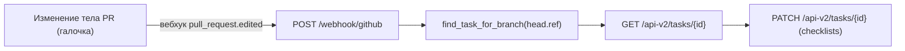
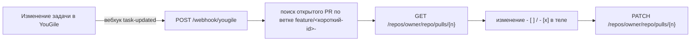

# AutoAgile — двусторонняя синхронизация YouGile ↔ GitHub

AutoAgile связывает задачи в **YouGile** с репозиторием **GitHub** и поддерживает их
в согласованном состоянии: по новым задачам создаются ветки и Pull Request'ы, а
состояние чек-листов синхронизируется между YouGile и GitHub Pull Request в обе
стороны в реальном времени.

---

## Содержание

1. [Назначение](#назначение)
2. [Состав системы](#состав-системы)
3. [Настройка файла .env](#настройка-файла-env)
4. [Запуск](#запуск)
5. [Настройка вебхуков](#настройка-вебхуков)
6. [Принцип работы](#принцип-работы)
7. [Устранение неполадок](#устранение-неполадок)
8. [Структура репозитория](#структура-репозитория)
9. [Требования](#требования)

---

## Назначение

Каждая новая задача в YouGile порождает в GitHub две сущности:

- **Ветку** вида `feature/<короткий-id>-<название>`;
- **Pull Request** (из ветки в `dev`) с чек-листом задачи в теле.

Далее состояние чек-листа синхронизируется автоматически:

- отметка пункта в **GitHub Pull Request** отражается в **YouGile**;
- отметка пункта в **YouGile** отражается в **GitHub Pull Request**.

Синхронизация выполняется вживую через вебхуки в обоих направлениях.

---

## Состав системы

Система состоит из трёх компонентов:

| Компонент | Команда запуска | Назначение |
| --- | --- | --- |
| Поллер | `python -m app.main` | Периодически опрашивает колонку YouGile и создаёт ветку для каждой новой задачи. |
| Вебхук-сервер | `uvicorn app.webhook_server:app --host 0.0.0.0 --port 8000` | Принимает вебхуки от GitHub и YouGile и синхронизирует чек-листы в реальном времени. |
| GitHub Actions | выполняется в GitHub | При пуше в ветку `feature/**` запускает тесты и создаёт Pull Request с чек-листом из YouGile. |

---

## Настройка файла .env

В корне проекта расположен файл `.env` (шаблон — `.env.example`). Требуется заполнить
следующие значения:

```bash
# --- YouGile ---
YOUGILE_BEARER_TOKEN=токен_из_YouGile        # Настройки -> API -> создать ключ
YOUGILE_PROJECT_ID=id_проекта
YOUGILE_BOARD_ID=id_доски
YOUGILE_COLUMN_ID=id_колонки                  # колонка, за которой ведётся наблюдение
YOUGILE_POLL_INTERVAL=10                      # период опроса в секундах

# --- GitHub ---
GITHUB_TOKEN=ghp_личный_токен                 # Personal Access Token со scope "repo"
GITHUB_REPO=owner/repo                         # например: rlxlxl/AutoAgile

# --- Секреты вебхуков ---
GITHUB_WEBHOOK_SECRET=произвольная_строка     # та же строка указывается в настройках вебхука GitHub
YOUGILE_WEBHOOK_SECRET=                        # должно оставаться пустым (см. примечание)
```

> **Примечание о `YOUGILE_WEBHOOK_SECRET`.** YouGile не подписывает свои вебхуки.
> Если задать это значение, сервер будет отклонять все запросы от YouGile с ответом
> `{"skipped":"invalid_signature"}`, и обратная синхронизация работать не будет.
> Поле необходимо оставлять пустым.

> **Примечание о применении настроек.** Значения считываются один раз при запуске.
> После изменения `.env` необходимо перезапустить поллер и вебхук-сервер.

### Получение значений YouGile

- **Токен:** YouGile → Настройки → раздел API.
- **project / board / column ID:** при первом запуске `python -m app.main` открывается
  интерактивное меню выбора проекта, доски и колонки, которое сохраняет эти
  идентификаторы в `.env`. Альтернативно — через API:
  `GET https://ru.yougile.com/api-v2/tasks?columnId=<id>` (поле `id` у объектов).

---

## Запуск

### 1. Установка зависимостей

```bash
python3 -m venv venv
source venv/bin/activate
pip install -r requirements.txt
```

### 2. Заполнение `.env`

См. раздел [Настройка файла .env](#настройка-файла-env).

### 3. Запуск вебхук-сервера (терминал №1)

```bash
source venv/bin/activate
uvicorn app.webhook_server:app --host 0.0.0.0 --port 8000
```

Проверка: обращение к `http://localhost:8000/health` должно возвращать
`{"status":"ok", ...}`.

### 4. Запуск поллера (терминал №2)

```bash
source venv/bin/activate
python -m app.main
```

### 5. Публикация сервера в интернет (терминал №3)

GitHub и YouGile должны иметь возможность обращаться к серверу, поэтому требуется
публичный HTTPS-адрес. Наиболее простой способ — ngrok:

```bash
ngrok http 8000
```

ngrok выдаёт адрес вида `https://xxxx.ngrok-free.dev` — далее он обозначается как `<host>`.

> При перезапуске ngrok публичный адрес меняется, и его необходимо повторно указать
> в вебхуках GitHub и YouGile (см. следующий раздел).

---

## Настройка вебхуков

### GitHub

Репозиторий → **Settings → Webhooks → Add webhook**:

- **Payload URL:** `https://<host>/webhook/github` (обратите внимание: `webhook`, без `s`)
- **Content type:** `application/json`
- **Secret:** значение `GITHUB_WEBHOOK_SECRET`
- **Which events:** «Let me select individual events» → отметить **Pull requests**
- Сохранить.

### YouGile

Подписка создаётся одним запросом (подставьте токен и `<host>`):

```bash
curl -X POST https://ru.yougile.com/api-v2/webhooks \
  -H "Authorization: Bearer ТОКЕН_YOUGILE" \
  -H "Content-Type: application/json" \
  -d '{"url":"https://<host>/webhook/yougile","event":"task-updated"}'
```

> Адрес `/webhook/yougile` указывается без `s`. Ошибочный вариант `/webhooks/...`
> приводит к ответам `404`.

Просмотр существующих подписок:

```bash
curl -s -H "Authorization: Bearer ТОКЕН_YOUGILE" https://ru.yougile.com/api-v2/webhooks
```

---

## Принцип работы

### Связывание Pull Request и задачи

Pull Request связывается с задачей YouGile по **имени ветки** `feature/<короткий-id>-...`,
где `<короткий-id>` — часть идентификатора задачи до первого дефиса. Ветку создаёт
поллер, поэтому связывание выполняется автоматически и не требует ручных действий.

> Рекомендуется называть задачи в YouGile кратко и латиницей — из названия
> формируется имя ветки. Пример: `fix_frontend` вместо «Почините фронт».

### Сопоставление пунктов чек-листа

В GitHub чек-лист представлен строками Markdown (`- [ ]` / `- [x]`), а в YouGile — массивом
объектов. Пункты сопоставляются по тексту без учёта регистра и лишних пробелов.

### Направление GitHub → YouGile



### Направление YouGile → GitHub



### Защита от зацикливания

Без защиты системы обновляли бы друг друга бесконечно: изменение в GitHub вызывает
изменение в YouGile, которое снова инициирует вебхук в GitHub. Для предотвращения этого
используется механизм «echo guard» (`app/sync_guard.py`): после записи в систему сервер
запоминает хеш результирующего состояния чек-листа и однократно игнорирует вебхук,
порождённый этой же записью.

---

## Устранение неполадок

| Симптом | Причина и решение |
| --- | --- |
| `/health` недоступен через ngrok | Не запущен `uvicorn`. Проверьте `http://localhost:8000/health`. |
| В логах `404 Not Found` на `/webhooks/...` | Лишняя `s` в адресе вебхука. Корректно: `/webhook/github` и `/webhook/yougile`. |
| Ответ `{"skipped":"invalid_signature"}` от `/webhook/yougile` | Значение `YOUGILE_WEBHOOK_SECRET` не пустое. Очистите его в `.env` и перезапустите сервер. |
| Изменения в `.env` не применяются | Настройки считываются при старте. Перезапустите поллер и `uvicorn`. |
| Ответ `{"skipped":"task_not_found"}` | Задача по имени ветки не найдена (неверный `YOUGILE_BOARD_ID`/`YOUGILE_COLUMN_ID` или задача в другой колонке). |
| Ответ `{"skipped":"pr_not_found"}` | Для задачи ещё не создан открытый Pull Request (CI не отработал). Это ожидаемо до создания PR. |
| После перезапуска ngrok синхронизация прекратилась | Изменился публичный адрес. Обновите URL в вебхуках GitHub и YouGile. |

Диагностика: панель ngrok `http://127.0.0.1:4040` отображает все входящие запросы и ответы
сервера, что позволяет определить причину пропуска синхронизации.

---

## Структура репозитория

```
app/
  main.py            # точка входа поллера
  poller.py          # опрос YouGile и создание веток
  webhook_server.py  # FastAPI-сервер: /webhook/github, /webhook/yougile, /health
  webhook_sync.py    # сопоставление чек-листов и вычисление хешей состояний
  sync_guard.py      # защита от зацикливания (echo guard)
  api.py             # клиент YouGile API (get_task, update_task, create_task)
  github_client.py   # клиент GitHub API (Pull Requests, проверка подписи)
  checklist.py       # конвертация Markdown <-> чек-лист YouGile, поиск задачи по ветке
  config.py          # чтение настроек из .env / yougile.env / окружения
  git_service.py     # создание и пуш веток
  create_pr.py       # создание PR с чек-листом (запускается в CI)
  sync.py            # синхронизация чек-листа PR -> YouGile (устаревшее, замещено вебхуком)
  menu.py            # интерактивный выбор проекта/доски/колонки
  models.py          # датаклассы
.github/workflows/
  ci.yml             # тесты и создание PR при пуше в feature/**
  sync.yml           # синхронизация чек-листа PR -> YouGile (временно отключено)
.env                 # локальные настройки (в .gitignore, в репозиторий не попадает)
.env.example         # шаблон настроек
```

---

## Требования

- Python 3.10+ (используется синтаксис `str | None`)
- Учётные записи и токены YouGile и GitHub
- ngrok или иной способ предоставить серверу публичный HTTPS-адрес
