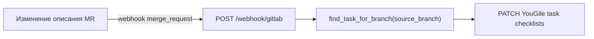
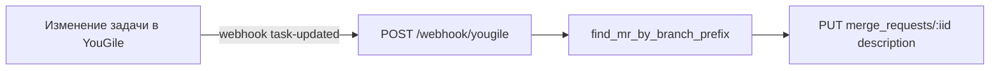

# AutoAgile — интеграция с GitLab.com

Эта папка содержит всё необходимое для работы AutoAgile с **GitLab.com**.
GitHub-интеграция остаётся в [`.github/`](../.github/) и [`app/github_client.py`](../app/github_client.py).

Общие компоненты (поллер, YouGile API, вебхук-сервер) используются без изменений.

---

## Содержание

1. [Состав](#состав)
2. [Настройка .env](#настройка-env)
3. [GitLab CI/CD Variables](#gitlab-cicd-variables)
4. [Project Webhook](#project-webhook)
5. [YouGile webhook](#yougile-webhook)
6. [Запуск](#запуск)
7. [Принцип работы](#принцип-работы)
8. [Устранение неполадок](#устранение-неполадок)

---

## Состав

| Компонент | Файл | Назначение |
| --- | --- | --- |
| GitLab CI | [`.gitlab-ci.yml`](../.gitlab-ci.yml) → [`ci.yml`](ci.yml) | Pipeline при push в `feature/**`: тесты + создание MR |
| Создание MR | [`create_mr.py`](create_mr.py) | Создаёт или обновляет Merge Request с чек-листом из YouGile |
| API-клиент | [`client.py`](client.py) | GitLab REST API v4 для MR и проверки вебхука |
| Вебхук | [`app/webhook_server.py`](../app/webhook_server.py) `/webhook/gitlab` | Синхронизация чек-листов MR ↔ YouGile |

---

## Настройка .env

Добавьте в корневой `.env` (рядом с GitHub-переменными):

```bash
# --- GitLab ---
GITLAB_TOKEN=glpat-...                    # Personal / Project Access Token (scope: api)
GITLAB_PROJECT_ID=12345                   # числовой ID или namespace/project
GITLAB_WEBHOOK_SECRET=произвольная_строка # тот же token, что в настройках webhook GitLab

# --- Поллер: другой репозиторий (не AutoAgile) ---
TARGET_REPO_PATH=/path/to/my-other-project   # абсолютный или ~ путь к clone целевого repo
GIT_BASE_BRANCH=dev                          # базовая ветка (по умолчанию dev)
```

`TARGET_REPO_PATH` — локальный clone проекта, куда поллер будет делать `git push origin`.
`GITLAB_PROJECT_ID` должен указывать на **тот же** проект на GitLab.

`GITLAB_PROJECT_ID` можно узнать на главной странице проекта GitLab (под названием)
или использовать путь вида `mygroup/AutoAgile`.

---

## GitLab CI/CD Variables

В GitLab: **Settings → CI/CD → Variables** добавьте:

| Variable | Описание | Masked |
| --- | --- | --- |
| `GITLAB_TOKEN` | Token с scope `api` для создания MR | да |
| `YOUGILE_BEARER_TOKEN` | Токен YouGile для загрузки чек-листа в CI | да |
| `YOUGILE_COLUMN_ID` | (опционально) ID колонки для поиска задачи | нет |
| `YOUGILE_BOARD_ID` | (опционально) ID доски | нет |

`CI_PROJECT_ID` и `CI_COMMIT_REF_NAME` GitLab подставляет автоматически.

---

## Project Webhook

**Settings → Webhooks → Add new webhook**:

- **URL:** `https://<host>/webhook/gitlab`
- **Secret token:** значение `GITLAB_WEBHOOK_SECRET`
- **Trigger:** Merge request events
- SSL verification: включить (для ngrok — по ситуации)

При изменении описания MR (галочки в markdown-чек-листе) GitLab отправит событие
`merge_request` с `action: update`, и сервер синхронизирует состояние в YouGile.

---

## YouGile webhook

Нужно чтобы yougile.env лежал в репо:

```bash

YOUGILE_BEARER_TOKEN=GsacQ+69vxWTLbkh0ZyP6VWYDAGv+3iU0rC-dzloWnYvypYNeXHXTKsUQE+QfL+X
YOUGILE_PROJECT_ID=a9d30eed-42dc-4fdb-8151-dfe0d444611b
YOUGILE_BOARD_ID=55e145ef-e1a6-4f7f-b137-f7f353e7e7b1
YOUGILE_COLUMN_ID=48ddb960-802b-4bc0-8abe-78d7d7510976
YOUGILE_POLL_INTERVAL=10

---

Без изменений — тот же эндпоинт `/webhook/yougile`:

```bash
curl -X POST https://ru.yougile.com/api-v2/webhooks \
  -H "Authorization: Bearer ТОКЕН_YOUGILE" \
  -H "Content-Type: application/json" \
  -d '{"url":"https://<host>/webhook/yougile","event":"task-updated"}'
```

Если в `.env` заданы и GitHub, и GitLab переменные, YouGile-вебхук обновит оба
(Pull Request и Merge Request). Для работы только с GitLab достаточно GitLab-переменных.

---

## Запуск

1. Установите зависимости и заполните `.env` (см. [корневой README](../README.md)).
2. Запустите вебхук-сервер:

```bash
uvicorn app.webhook_server:app --host 0.0.0.0 --port 8000
```

3. Проверьте `/health` — поле `"gitlab": true` означает, что GitLab настроен.
4. Запустите поллер: `python -m app.main`
5. Опубликуйте сервер через ngrok: `ngrok http 8000`
6. Push в ветку `feature/**` на GitLab.com → pipeline создаст MR.

---

## Принцип работы

### GitLab → YouGile



### YouGile → GitLab



Связывание MR и задачи — по имени ветки `feature/<короткий-id>-...`, как в GitHub-версии.

---

## Устранение неполадок

| Симптом | Причина и решение |
| --- | --- |
| `/health` показывает `"gitlab": false` | Не заданы `GITLAB_TOKEN` или `GITLAB_PROJECT_ID` в `.env`. |
| `{"skipped":"invalid_signature"}` от `/webhook/gitlab` | `GITLAB_WEBHOOK_SECRET` не совпадает с Secret token в настройках webhook GitLab. |
| Pipeline не запускается | Push должен быть в ветку `feature/**`. |
| MR не создаётся | Проверьте `GITLAB_TOKEN` в CI/CD Variables (scope `api`, роль Maintainer+). |
| `{"skipped":"mr_not_found"}` | CI ещё не создал MR для задачи — ожидаемо до первого успешного pipeline. |
| `{"skipped":"task_not_found"}` | Задача не найдена по ветке — проверьте `YOUGILE_COLUMN_ID` / `YOUGILE_BOARD_ID`. |

Диагностика входящих запросов: панель ngrok `http://127.0.0.1:4040`.
